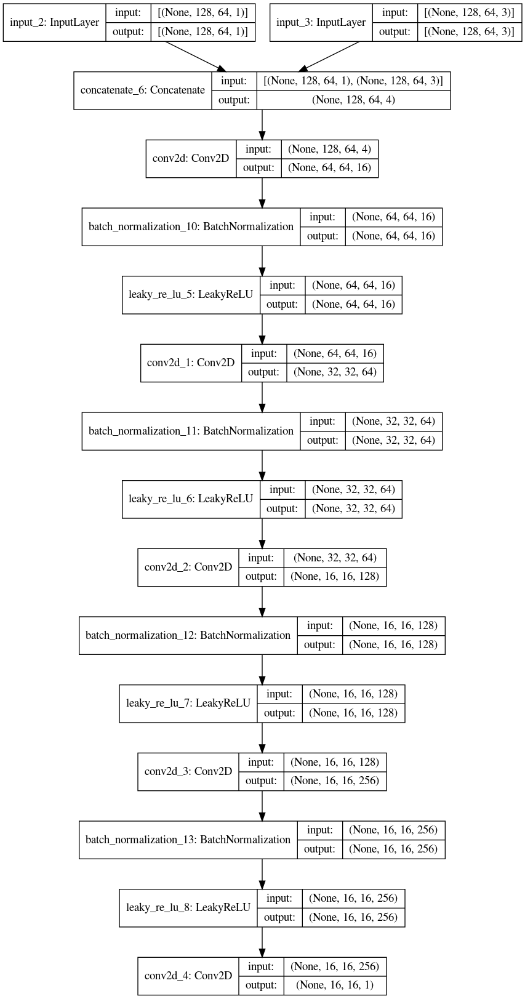

# Pix2Flows

Computational Fluid Dynamics (CFD) is a resource intensive solution to fluid flow modelling. These pose a serious contraint on usability and accessibility of such methods. Data driven methods are a good approach for combating these issues but are limited in terms of reliability and physical correctness. This project aims to solve these two problems at the same time. I propose Pix2Flows, a Physics-informed Conditional Generative Adversarial Network (GAN) based on modified Pix2Pix architecture for prediction of flow fields around custom geometries. This is in extenstion to my work on [DeepSteadyFlows](https://github.com/ritvik03/DeepSteadyFlows) and produces better performance than it on test cases as well as custom geometries. It also gets rid of the visual artifact present in previous methods and is more robust to complex shape transformation.

## Model Evolution
Below animation shows evolution of model results on one particular geometry between epoch 0 to 180.

# Results
Few randomly picked results

***

***

***

***

***

# Custom Results

# Usage

> **$ python3 draw.py**
- Draw the shape keeping the mid point of canvas enclosed in the buff body drawn

- Press "m" to fillup

- Press "Esc" to save and terminate.

> **$ python3 pred.py**
- loads up model from checkpoint
- shows prediction as matplotlib figure
- saves prediction as custom.png

## Architecture
**[NOTE]** Add details about architecture later

### Generator

### Discriminator

## Loss function

### Discriminator
Discriminator Loss function is sum of cross-entropy losses for determination of real and fake samples

### Generator

Generator Loss has 4 components:
> **Fake generation loss** : how good the generator is at fooling the discriminator

> **Mean absolute error** : How closely the predictions matches the true output

> **NS-loss** : How much the predictions deviate from real world physics (Navier-Stokes equation)

> **Gradient Loss** : Deviation in x and y spatial gradients of predicted fields from true fields

**NS-loss** : ex2 + ey2

- <strong>ex</strong> : Error in steady state navier-stokes equation in X-direction

- <strong>ey</strong> : Error in steady state navier-stokes equation in Y-direction

- <strong>continuity_loss</strong> : Square of error in continuity equation in 2 dimensions

### Final Generator loss function :
**Loss = Fake generation loss + λ1 MAE +  λ2 NS-loss + λ3 Gradient_loss**

- λ1 = 100
- λ2 = 10000
- λ3 = 100

[Note]: More tinkering with network architecture and loss hyperparameters required. Also, generalize this to 3D

## About me
This repository is made by Ritvik Pandey for the academic use as better implementation of my Maters Thesis Project (MTP) for Department of Mechanical Engineering, Indian Institute of Technology Kharagpur (IIT-KGP)

Contact: ritvik.pandey03@gmail.com

